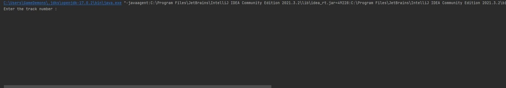
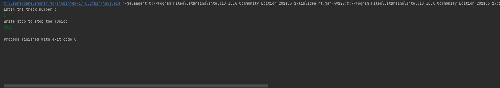

# 
DSMusicPlayer
 
 A console music player that plays 2 different Demon Slayer Music
   
 This app was written with the sole purpose of understanding and learning the use of external media libraries. It is a command line program that plays one of the two    Demon Slayer songs based on the input. There may be future updates on it for adding extra functionality.
 
  
 When executed program demands the index of song to be played. The user can specify either "1" or "2" to play the song.
 

 
  
 After specifying the index the song begins to play. Enter "stop" to pause the music.
 

 
 
## Libraries Used

- [Lomboc](https://projectlombok.org/)
- [JLayer](https://github.com/umjammer/jlayer)
